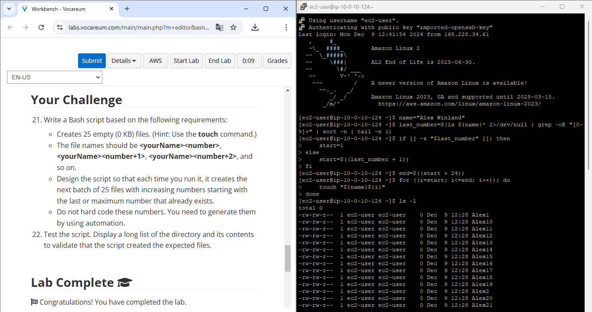

# Laboratório de Desafio: Exercício de Bash Shell Scripting 🛠️🎯



Para finalizar o módulo de Linux no AWS Restart, realizei este laboratório-desafio como parte do processo de conclusão e preparação para os próximos passos. ⚡

## 🎯 Objetivo do Desafio

Criar uma pasta cheia de arquivos vazios, incrementando números automaticamente a cada execução do script!

## 🚀 O que foi feito

Eu criei um script Bash que:

1️⃣ Cria 25 arquivos vazios com nomes como `Alex1`, `Alex2`, e assim por diante.

2️⃣ Faz isso de forma automática, começando do último número gerado (sem precisar editar o script).

3️⃣ É super prático: basta rodar o script, e ele entende sozinho qual é o próximo número na sequência.

## 🔧 O Código

```bash
#!/bin/bash
name="Alex Winland"

# Descobre o maior número existente
last_number=$(ls ${name}* 2>/dev/null | grep -oE "[0-9]+" | sort -n | tail -n 1)

# Define o próximo número inicial
if [[ -z "$last_number" ]]; then
    start=1
else
    start=$((last_number + 1))
fi

# Calcula o número final para a sequência
end=$((start + 24))

# Cria os arquivos
for ((i=start; i<=end; i++)); do
    touch "${name}${i}"
done

# Exibe os arquivos criados
ls -l
```

## 🔍 Teste e Validação

📂 Listei os arquivos criados com `ls -l` e, voilà, tudo funcionando perfeitamente! 🚀

## 💡 Dica

Esse script é uma mão na roda para automações simples e mostra como o Bash pode ser poderoso quando você precisa organizar e manipular arquivos em lote.

## 💬 Contribua

E aí, o que achou dessa pequena demonstração de automação em Bash? Alguma ideia de onde você usaria algo assim? Vamos conversar! 👇
